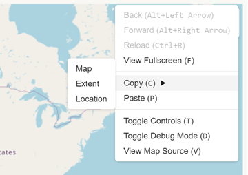

The `<map-meta>` element is an extended HTML `meta` element, for use in Web 
maps.

<!-- demo / example -->
<iframe src="../../../demo/map-meta-demo/" title="MapML Demo" height="410" width="100%" scrolling="no" frameBorder="0"></iframe>

## Attributes

### `name`

The `name` attribute identifies the type of metadata that is being set. Possible
values of `name` related to maps include:

| Name          | Description                                          	  |
|--------------	|--------------------------------------------------------	|
| projection    | Set the [projection](../mapml-viewer/#projection) for the document |
| extent        | Define the bounds of the document in terms of corner position keywords and axis names, potentially combined with a zoom value if necessary (depending on coordinate system). |
| cs            | Identifies the default coordinate reference system of coordinate strings found in the document. |
| zoom          | Specify the zoom range min, max and default zoom value for displaying the document contents. The 'native' zoom range of [templated map content](../link#tref) is specified by the min/max attributes of associated [zoom inputs](../input#type).  If templated content is not described by associated zoom input min/max/value attributes, the values specified in a `<map-meta name=zoom>` will be used as fallback, if it exists.  If no `<map-meta name=zoom>` exists, the corresponding min/max values from the projection will be used. |

---
### `content`

| `name`          | `content` value                                          	  |
|--------------	|--------------------------------------------------------	|
| projection    | A case-sensitive [projection name](../mapml-viewer#projection), or a [custom projection name](../../api/mapml-viewer-api#definecustomprojectionoptions) |
| extent        | \(\(_[position keyword](../input#position)_\)-\(_[axis name](../input#axis)_\)=\(_axis value_\)\(,\)\)4\(,\)\(zoom=\(_zoom value_\)\)0,1 |
| cs            | A case-sensitive [coordinate system abbreviation](../input#units). |
| zoom          | (min=_minimum zoom value_,max=_maximum zoom value_,)(value=_current zoom value_) |

:::tip

The grammar rules for the `<map-meta name="extent" content="..."></map-meta>`
`content` attribute require that you specify coordinates of the top-left and 
bottom-right corners of the extent being marked up. You must specify the axis values of the 
extent as values for a set of four comma-separated keys which identify the coordinate
system being used (i.e. pcrs, gcrs, tile, tilematrix, map or tcrs) by virtue of 
the axis names. For example `top-left-easting=-8433179` identifies that the 
coordinate system being used is pcrs.  You cannot mix coordinate systems within 
a single `content` attribute value, for example `top-left-easting=-8433179, top-left-latitude=49.02174,...`
is not legal.

You can copy a correctly marked-up `<map-meta name="extent" content="...">` value 
onto the clipboard for the current map viewport, in pcrs coordinates (by default), 
via the map context menu Copy > Extent item as shown below:



:::

---

| <!-- -->    | <!-- -->    |
|-------------|-------------|
| [Content categories](https://developer.mozilla.org/en-US/docs/Web/Guide/HTML/Content_categories) | [Metadata content](https://developer.mozilla.org/en-US/docs/Web/Guide/HTML/Content_categories#metadata_content) |
| Permitted content | None, it is an [empty element](https://developer.mozilla.org/en-US/docs/Glossary/Empty_element).  |
| Tag omission | While the HTML `<meta>` element is a void element, the polyfill `<map-link>` must have an end tag. |
| Permitted parents | Inline: the `<layer->` element. In a MapML document: the `<map-head>` element. |
| Implicit ARIA role   | [No corresponding role](https://www.w3.org/TR/html-aria/#dfn-no-corresponding-role) |
| Permitted ARIA roles | No role permitted |
| DOM interface | [HTMLMetaElement extension](https://developer.mozilla.org/en-US/docs/Web/API/HTMLMetaElement) |

---

## Examples

### Setting zoom

Using the `<map-meta>` element to specify the native zoom and fallback zoom range 
for a `<map-feature>`.  The coordinate encoding is narrowly determined for the feature,
by the `<map-geometry cs="gcrs">` attribute, which tells the polyfill how to parse and
process strings of coordinates found in descendant `<map-coordinates>` elements.

```html
<layer- label="Favourite Restaurant" checked>
  <map-meta name="projection" content="OSMTILE"></map-meta>
  <map-meta name="zoom" content="min=0,max=22,value=3"></map-meta>
  <map-feature>
    <map-featurecaption>Big Daddy's Crab Shack</map-featurecaption>
      <map-geometry cs="gcrs">
          <map-point>
            <map-coordinates>-75.690276 45.41868</map-coordinates>
          </map-point>
      </map-geometry>
  </map-feature>
</layer->
```

### Setting extent

Using the `<map-meta>` element to establish the pcrs (easting,northing) **extent** of 
a map layer, the coordinates of which are encoded as gcrs pairs. 

```html
<layer- label="Favourite Restaurant" checked>
  <map-meta name="projection" content="OSMTILE"></map-meta>
  <map-meta name="zoom" content="min=0,max=22,value=3"></map-meta>
  <map-meta name="extent" content="top-left-easting=-8433179, top-left-northing=5689316, bottom-right-easting=-8420968,bottom-right-northing=5683139"></map-meta>
  <map-feature>
    <map-featurecaption>Big Daddy's Crab Shack</map-featurecaption>
      <map-geometry cs="gcrs">
          <map-point>
            <map-coordinates>-75.690276 45.41868</map-coordinates>
          </map-point>
      </map-geometry>
  </map-feature>
</layer->
```

### Fallback cs for &lt;map-geometry&gt;

Using the `<map-meta>` to specify a fallback coordinate encoding for geometries in
the layer. The encoding of the coordinates is identified by the use of the 
`<map-meta name="cs" content="gcrs">` element. Such a declaration tells the 
polyfill how to parse and process any coordinates that don't have an ancestor 
`<map-geometry cs="">` coordinate encoding declaration.  Note that the zoom level
at which the feature should be displayed is not specified, nor the extent. Both
values will fall back to the default values for the projection. 

```html
<layer- label="Favourite Restaurant" checked>
  <map-meta name="projection" content="OSMTILE"></map-meta>
  <map-meta name="cs" content="gcrs" ></map-meta>
  <map-feature>
    <map-featurecaption>Big Daddy's Crab Shack</map-featurecaption>
      <map-geometry>
          <map-point>
            <map-coordinates>-75.690276 45.41868</map-coordinates>
          </map-point>
      </map-geometry>
  </map-feature>
</layer->
```

### Default metadata

Allowing all metadata values to default to those of the map's projection.  The 
feature will be displayed at all zoom levels, and the coordinates are by default
interpreted to be `gcrs` (longitude latitude).  The extent of the layer defaults 
to that of the projection.

```html
<layer- label="Favourite Restaurant" checked>
  <map-feature>
    <map-featurecaption>Big Daddy's Crab Shack</map-featurecaption>
      <map-geometry>
          <map-point>
            <map-coordinates>-75.690276 45.41868</map-coordinates>
          </map-point>
      </map-geometry>
  </map-feature>
</layer->
```

---

## Specifications

| Specification                                                |
|--------------------------------------------------------------|
| [MapML meta element](https://maps4html.org/MapML/spec/#the-meta-element-0) |
| [HTML meta element](https://html.spec.whatwg.org/multipage/semantics.html#the-meta-element) |
---

## Requirements


Need to be documented.

---

## See Also


---

> - [Edit this page on **Github**](https://github.com/Maps4HTML/web-map-doc/edit/main/docs/elements/meta.md)
> - [Chat with us on **Gitter**](https://gitter.im/Maps4HTML/chat)

