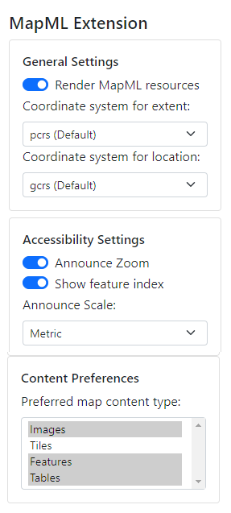

There are several additional requirements that are addressed by the extension.

### Localization

By default, the extension uses the browser's locale to display any `<mapml-viewer>` UI in the user's locale. Note that if the UI is not localized to your browser's language, it is likely because there currently exists no translation of the UI strings for your locale.  Localization contributions are welcome.  Languages that are available at the time of writing are english, french and swedish.

### Feature Indexing

When turned on through the extension, enables a square in the middle of the map to enable a keyboard index menu of features located inside the square. 

### Announce Zoom Level

When toggled through the extension, announces the zoom level through screen readers (this is on by default).

### Announce Scale

Announces the map scale through screen readers in metric or imperial units (metric is selected by default).

### Render MapML resources

When turned on through the extension popup (it is on by default as shown above, but can be turned off), the extension enables the rendering of map documents that have no host document, just as browsers can render image resources (image/*) that have no host document, by synthesizing a host document at run time.  The feature will recognize documents that are served to a browser tab (a top level browsing context) that are served with the "text/mapml" or "application/xml" Content-Type header. In the latter case, the extension will "sniff" for a root `<mapml- xmlns="http://www.w3.org/1999/xhtml">` element.

### Set a coordinate system for copy operations

By default, the coordinate system (cs) for copying the map extent using the map
context menu is projected coordinates (PCRS), and that for copying locations is 
by default geodetic (GCRS). When changed to another through the extension 
user interface, the selected cs will be used for subsequent copy operations.

### Select map content preferences

By default, no preference is expressed by the user as to what their preferred
content type for maps may be.  Some users may prefer focusable feature
data in the map where possible; others may opt for image-based or tiled-image
based map content.  Others may wish to experience only textual feature data in 
the form of an accessibility technology (AT)-friendly table that is by default 
sorted in ascending order of distance from map center, but that may be 
sorted by different column headings selected by the user. To establish a set of
preferences, select the applicable combination of entries from the "Content Preferences"
list (select more than one entry by holding Ctrl or Shift while selecting).

Such preferences may be honoured by a map author via inclusion in [map 'media' queries](../api/mapml-viewer-api#matchmediamediaquerystring).

## Requirements

[Report problems with these requirements on GitHub](https://github.com/Maps4HTML/HTML-Map-Element-UseCases-Requirements/issues/new?title=-SUMMARIZE+THE+PROBLEM-&body=-DESCRIBE+THE+PROBLEM-)

<b>requirement
enhancement
impractical
undecided
under discussion</b>

|  | Spec | Viewer | API |
|:---------------------------------------------------------------------------------|:------: |:-----: |:---: |
| [**The GeoWeb - proposed Epic**](https://github.com/Maps4HTML/HTML-Map-Element-UseCases-Requirements/issues/172) |  |  |  |
| 
[Enable federation via links](https://github.com/Maps4HTML/HTML-Map-Element-UseCases-Requirements/issues/19)
 | full | full |  |
| [**Client-side Mapping API Capabilities (6.0)**](https://maps4html.org/HTML-Map-Element-UseCases-Requirements/#client-apis) |  |  |  |
| 
[Create, initialise, and display a map from a map document resource](https://github.com/Maps4HTML/HTML-Map-Element-UseCases-Requirements/issues/259)
 | full | full |  |

---

> - [Edit this page on **Github**](https://github.com/Maps4HTML/web-map-doc/edit/main/docs/extension/features.md)
> - [Chat with us on **Gitter**](https://gitter.im/Maps4HTML/chat)
