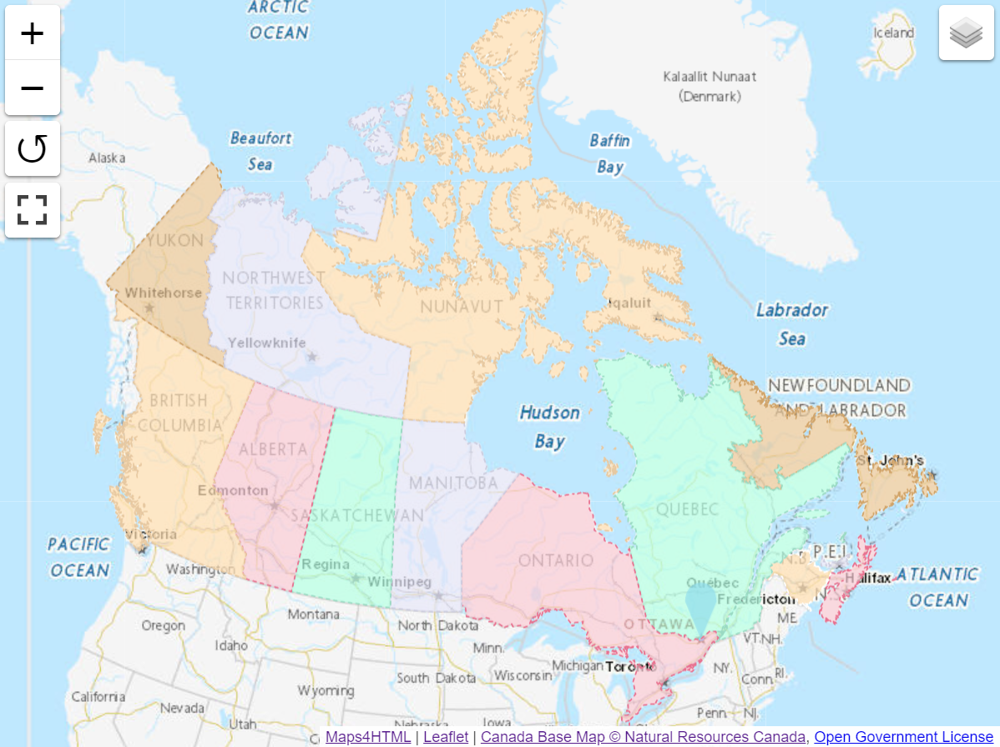

The web-map custom element suite provides a Web map viewer which is modelled after the HTML5 `<video>` tag. It is a simple way to get started publishing Web maps. 

For example, markup such as this:

```html
<mapml-viewer projection="CBMTILE" zoom="3" lat="62.7" lon="-90.3" controls>
  <layer- label="CBMT" src="https://geogratis.gc.ca/mapml/en/cbmtile/cbmt/" checked></layer->
  <layer- label="Restaurants" src="demo/restaurants.mapml" checked></layer->
  <layer- label="Canada's Provinces and Territories" src="demo/canada.mapml" checked></layer->
</mapml-viewer>
```

can be used to create a map like this:


