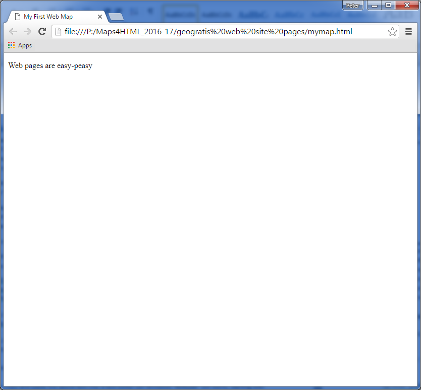
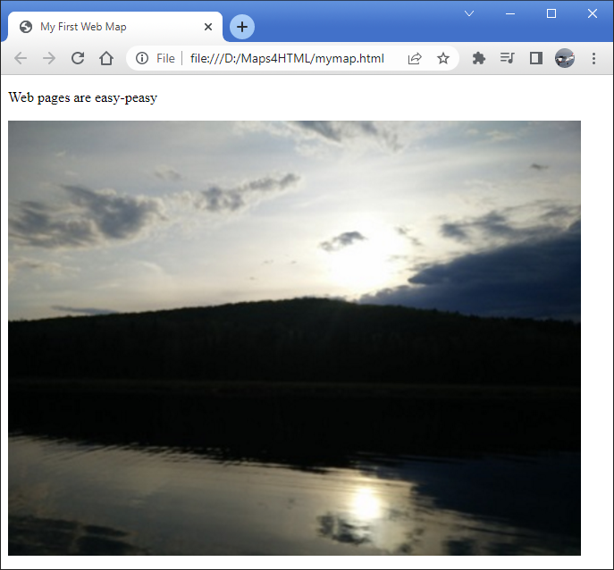

To make a web map, all you need is a little bit of knowledge of HTML, some of which you can find here.  You will find that HTML is a language that fills a bigger role for you as your knowledge of it grows.  There are many excellent free resources available on the web for learning HTML in all its richness.  We will try to give you what you need to get started with maps here.

A web page is an 'application-inside-an-application', in which the content of a textual document (your page *is* a textual HTML document) is activated or run by the browser (the 'outside' application).

To begin, we will create a simple web page with some text, an image and a map.  You can copy-and-paste the HTML code you find here to first create and then progressively update your page to add more content.

Let us start with some text paragraphs, and we will add an image and a map after that.

An HTML5 document starts with some 'boilerplate' text, and is followed by some text 'tags' (or elements – the parts of the document that begin with `<` and end with `>`) which define sections of the document:

```html
<!DOCTYPE html>
<html>
      <head>
          <title>My First Web Map</title>  
      </head>
      <body>    
          <p>Web pages are easy-peasy</p>  
      </body>
</html>
```

The elements are the instructions which tell the browser what to do, and where.

If you copy-and-paste the above text into a text editor (for example 'Notepad' on MS Windows), starting with `<!DOCTYPE html> `and ending with `</html>`, and save it as 'mymap.html', you should be able to view it with a web browser by double-clicking on 'mymap.html' in the operating system. It should look something like this:



The `<p></p>` element is used to wrap text paragraphs. Paragraphs are one of the basic building blocks of documents. Another building block is images or pictures. An image can be included in an HTML document 'by reference'. That is, even though an image is not text (images are another form of 'binary' data), it can be included in a text document by using the appropriate element and referring to it by its URL. The browser will lay out the document, fetch the image and include it in the flow of the text where the `` element occurs.

Let us include an image in our document now:

```html
<!DOCTYPE html>
<html>
     <head>    
         <title>My First Web Map</title>
     </head>  
     <body>
         <p>Web pages are easy-peasy</p>
		 // highlight-next-line
           
     </body>
</html>
```

Once you save the change highlighted above, you can refresh the document (by clicking on the browser refresh button) you will see a page that looks like this:



So far so good. Let us replace that image with a map now.

You have learned how to include resources like images in your web page, and now we will do something similar with a map. Today's browsers do not yet support maps directly, but that is OK, because they *do* support 'custom elements'. Custom elements are like regular HTML elements that we have already seen (e.g. `<p>` element), except their behaviour is provided by JavaScript programs. In order for your browser to use the custom `<mapml-viewer>` element, we have to include a couple of web resources (JavaScript programs) into our HTML document. That is pretty easy, and you achieve that similarly (but differently) to the technique you used to include an image above. Include the highlighted lines below at the same location (that is, within the `<head>` element) in your evolving HTML document:

```html
<!DOCTYPE html>
<html>
    <head>
       <title>My First Web Map</title>
	   // highlight-next-line
       <script type="module" src="https://cdn.jsdelivr.net/npm/@maps4html/mapml@latest/dist/mapml.js" crossorigin></script>
    </head>
    <body>
      <p>Web pages are easy-peasy</p>
      
  </body>
</html>
```

It is worth noting that in the future, we are hopeful that browsers will begin to support web maps with the new `<mapml-viewer>` element syntax, but for now we can accomplish everything we need to without waiting for that day to come.

The next step in our lesson is to remove the image and replace it with a map, using the `<mapml-viewer>` element with a single layer. To create a dynamic web map in our page now is as easy as including the lines highlighted below, and saving:

```html
<!DOCTYPE html>
<html>
      <head>
          <title>My First Web Map</title>
          <script type="module" src="https://cdn.jsdelivr.net/npm/@maps4html/mapml@latest/dist/mapml.js" crossorigin></script>
      </head>
      <body>
         <p>Web <s>pages</s> maps are easy-peasy</p>
		 // highlight-start
         <mapml-viewer projection="OSMTILE" zoom="2" lat="67.6" lon="-100.9" width="400" height="300" controls>
             <map-layer src="https://geogratis.gc.ca/mapml/en/osmtile/osm/" label="Open Street Map" checked ></map-layer>
         </mapml-viewer>
		 // highlight-end
      </body>
</html>
```

If you save, and then press the 'Refresh' button, you should see a simple map that looks something like this:


:::tip

View the final page [here](https://maps4html.org/web-map-doc/demo/Tutorial/Getting%20Started/).

:::

You will notice that if you use the mouse or keyboard on the map that you can zoom and pan, as well as turn the layer off and on.

Congratulations! You have just created your first web map. You are ready to proceed to more advanced mapping tasks using the web `<mapml-viewer>` custom element.