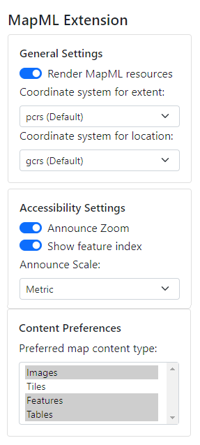

L’extension répond à plusieurs autres exigences.

### Localisation 

Par défaut, l’extension utilise les paramètres de lieu du navigateur pour afficher une interface utilisateur `<mapml-viewer>` dans les paramètres de lieu de l’utilisateur. Notez que si la langue de l’interface utilisateur ne correspond pas à celle de votre navigateur, il est probable que les chaînes de l’interface utilisateur ne soient actuellement pas traduites pour vos paramètres de lieu. Les contributions en matière de localisation sont les bienvenues. Au moment de la rédaction du présent document, les langues disponibles sont l’anglais, le français et le suédois.

### Indexation d’entités

Lorsque cette fonction est activée au moyen de l’extension, elle affiche un carré au centre de la carte afin d’ouvrir le menu de l’index des entités situées dans le carré, lequel menu est accessible par le clavier.

### Annonce des déplacements et du zoom

L'activation de cette fonction dans l’extension permet d'annoncer les déplacements et les zooms dans la carte au moyen de lecteurs d’écran.

### Rendu des ressources en MapML

L'activation de cette fonction dans la fenêtre contextuelle d'extension (elle est activée par défaut comme le montre l'image ci-dessus, mais elle peut être désactivée) permet d'afficher des documents cartographiques qui n'ont pas de document hôte, tout comme les navigateurs peuvent présenter des ressources d'image  (image/*) qui n'ont pas de document hôte en synthétisant un document hôte au moment de l'exécution. Cette fonctionnalité reconnaîtra les documents qui sont servis à un onglet de navigateur (ou contexte de navigation général) ou qui sont servis avec l'en-tête  "text/mapml" ou "application/xml" Content-Type. Dans le dernier cas, l'extension recherchera un élément racine `<mapml- xmlns="http://www.w3.org/1999/xhtml">`.

### Définir un système de coordonnées pour les opérations de copie

Par défaut, le système de coordonnées (cs) pour copier l'étendue de la carte à 
l'aide du menu contextuel de la carte est celui des coordonnées projetées (PCRS), 
et celui pour copier les endroits est par défaut géodésique (GCRS). Lorsqu'il est 
changé par l'interface utilisateur de l'extension, le système de coordonnées 
sélectionné sera utilisé pour les opérations de copie ultérieures.

## Exigences 

[Signaler les problèmes liés à ces exigences sur GitHub](https://github.com/Maps4HTML/HTML-Map-Element-UseCases-Requirements/issues/new?title=-SUMMARIZE+THE+PROBLEM-&body=-DESCRIBE+THE+PROBLEM-)

<b>exigence
amélioration
peu pratique
indécis
en cours de discussion</b>

|  | Spéc. | Visualiseur | API |
|:---------------------------------------------------------------------------------|:------: |:-----: |:---: |
| [**Le GeoWeb – Modèle Epic proposé**](https://github.com/Maps4HTML/HTML-Map-Element-UseCases-Requirements/issues/172) |  |  |  |
| 
[Permettre la fédération au moyen de liens](https://github.com/Maps4HTML/HTML-Map-Element-UseCases-Requirements/issues/19)
 | complet | complet |  |
| [**Capacités de cartographie de l'API côté client (6.0)**](https://maps4html.org/HTML-Map-Element-UseCases-Requirements/#client-apis) |  |  |  |
| 
[Créer, initialiser et afficher une carte à partir d'une ressource d'un document de carte](https://github.com/Maps4HTML/HTML-Map-Element-UseCases-Requirements/issues/259)
 | complet | complet |  |

---

> - [Modifier cette page sur **Github**](https://github.com/Maps4HTML/web-map-doc/edit/main/docs/extension/features.md)
> - [Discutez avec nous sur **Gitter**](https://gitter.im/Maps4HTML/chat)
