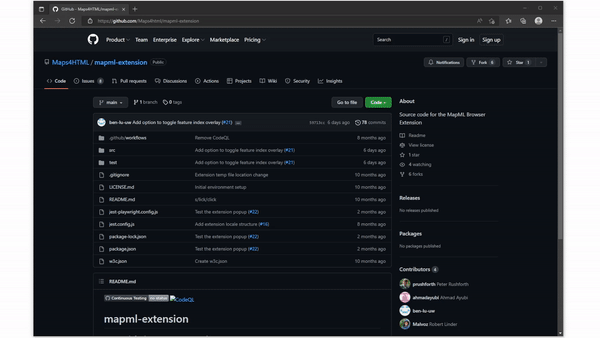
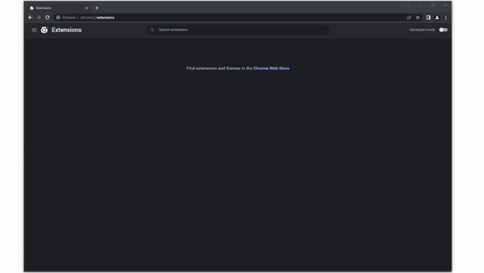
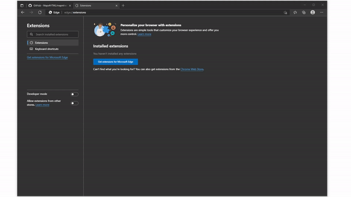

The MapML browser extension is used to add additional features to chromium browsers. It can be installed from the Maps4HTML Github Repository:

[https://github.com/Maps4HTML/mapml-extension](https://github.com/Maps4HTML/mapml-extension)

The source code can be downloaded by clicking Code -> Download ZIP. 

Once the source code is downloaded and extracted, it can be loaded as an extension through chromium browsers:

## Loading Extension to Browser

Since the extension has not yet been released to web stores, it can currently be loaded in the following browsers by loading the downloaded extension to the broweser.

### Google Chrome

- Open Chrome and go to `chrome://extensions/`
- Turn on Developer Mode
- Click the `Load unpacked` button, and navigate to the `/src` folder found in the root of the downloaded source code

### Microsoft Edge

- Open Edge and go to `edge://extensions/`
- Turn on Developer Mode
- Click the `Load unpacked` button, and navigate to the `/src` folder found in the root of the downloaded source code

