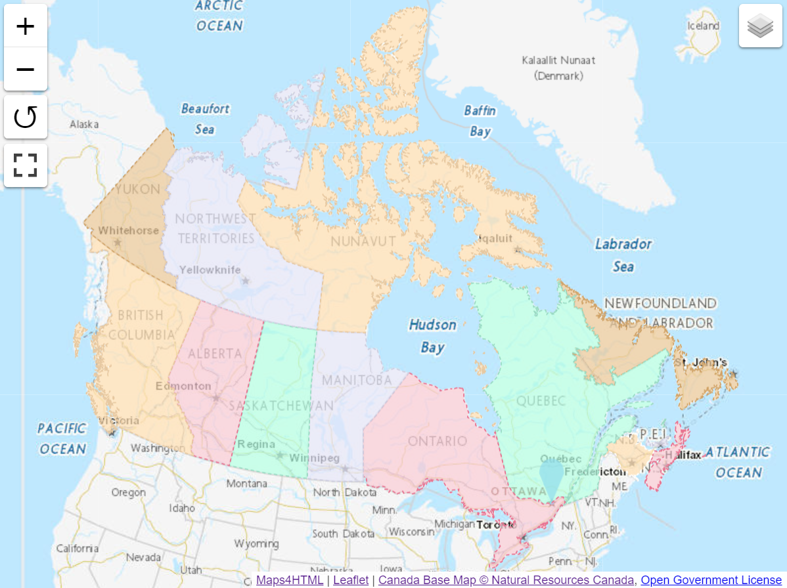

Les éléments personnalisés « web-map » fournissent un visualiseur de cartes Web modélisé en fonction de la balise HTML5 `<video>`. Ils offrent un moyen simple de faire ses premiers pas dans la publication de cartes Web.

Par exemple, le balisage suivant : 

```html
<mapml-viewer projection="CBMTILE" zoom="3" lat="62.7" lon="-90.3" controls>
  <layer- label="CBMT" src="https://geogratis.gc.ca/mapml/en/cbmtile/cbmt/" checked></layer->
  <layer- label="Restaurants" src="demo/restaurants.mapml" checked></layer->
  <layer- label="Provinces et territoires du Canada" src="demo/canada.mapml" checked></layer->
</mapml-viewer>
```

peut-être utilisé pour créer une carte comme celle-ci :


