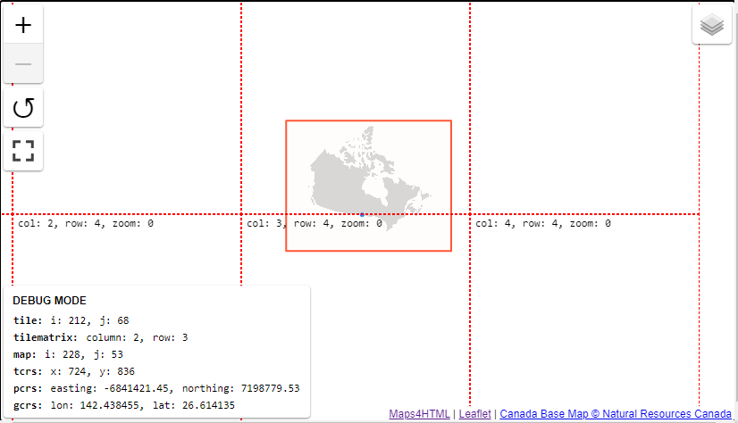
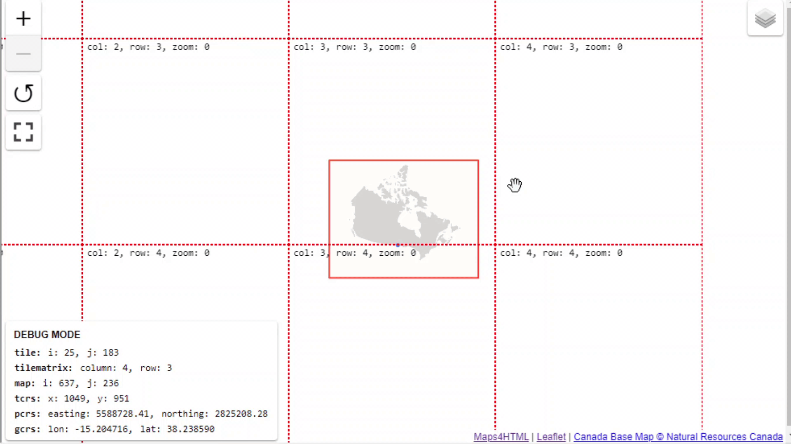

This function allows users to debug both the map and the coordinate system of the map. It adds 
the following visuals to the map; tile outlines, projection center, layer extents, and a debug
panel that display's the mouse's current location in the various coordinate systems.

- The dotted red line represents the tile boundaries at the current zoom level
- the solid red line represents the layer's extent, if there are multiple layers the solid line may be a variety of colours
- The bottom left panel displays the current mouse's position

## Accessing Debug Mode

### Map's Context Menu

Debug mode can be enabled through the map context menu (right-click or Shift-F10):

### Map's API

Toggling debug mode can also be done through the viewer's API, see the [`toggleDebug()` method](../api/mapml-viewer-api.md#toggledebug) for more.
