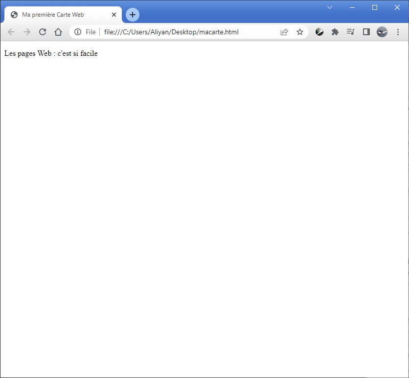
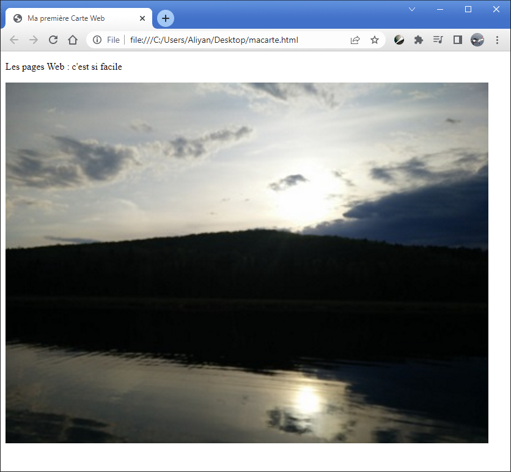
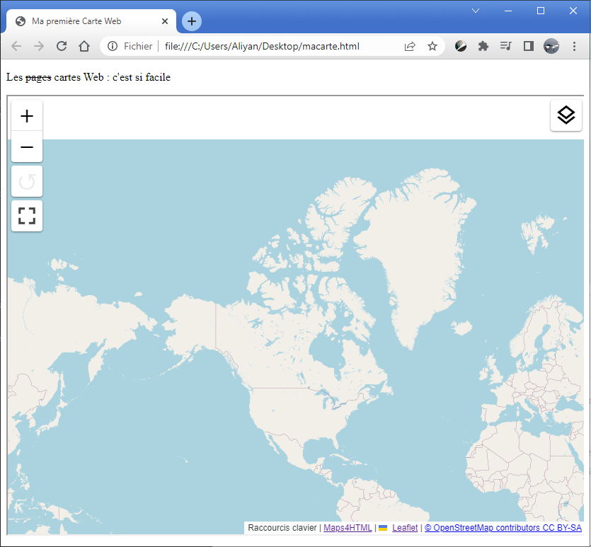

Pour faire une carte Web, vous n'avez besoin que des connaissances de base en langage HTML. Il y a beaucoup d'excellentes ressources disponibles sur le Web pour apprendre le langage HTML. En espérant que vous trouverez ici ce dont vous avez besoin pour commencer.

Une page Web est une « application-dans-une-application », dans laquelle le contenu d'un document textuel (votre page *est* un document HTML textuel) est exécuté par le navigateur (l'application « à l'extérieur »).

Pour commencer, nous allons créer une simple page Web qui contient du texte, une image et une carte. Vous pouvez copier et coller le code HTML que vous trouvez ici pour créer d'abord puis progressivement mettre à jour votre page Web en ajoutant plus de contenu.

Commençons par un paragraphe de texte et par la suite nous allons ajouter une image et une carte.

Un document HTML5 commence par un texte « passe-partout », et est suivi par certains textes « balisés » (ou éléments - les parties du document qui commencent par `<` et se terminent avec `>`) :

```html
<!DOCTYPE html>
<html>
      <head>
          <title>Ma première Carte Web</title>  
      </head>
      <body>    
          <p>Les pages Web : c'est si facile</p>  
      </body>
</html>
```

Les éléments sont les instructions qui indiquent au navigateur ce qu'il faut faire et où.

En copiant et collant le texte ci-dessus dans un éditeur de texte (par exemple 'Notepad' dans MS Windows), en commençant par `<!DOCTYPE html>` et en terminant par `</html>`, puis en l'enregistrant comme 'macarte.html', vous devriez être en mesure de le voir avec un navigateur Web en double-cliquant sur 'macarte.html' dans le système d'exploitation. Il va ressembler à ceci:



L'élément `<p></p>` est utilisé pour la mise en page des paragraphes de texte. Le paragraphe est l'un des éléments de base des documents. D'autres composantes dans la construction des documents sont des images ou des photos. Une image peut être incluse dans un document HTML par référence avec son URL. Une image peut être incluse dans un document HTML en se référant à son URL. Autrement dit, même si une image n'est pas du texte (elle est une autre forme de données 'binaires'), elle peut être incluse dans un document de texte en utilisant l'élément approprié et en se référant à son URL. Le navigateur présente le document, récupère l'image et l'inclut dans le texte où l'élément `` se trouve.

Nous allons maintenant inclure une image dans notre document:

```html
<!DOCTYPE html>
<html>
     <head>    
         <title>Ma première Carte Web</title>
     </head>  
     <body>
         <p>Les pages Web : c'est si facile</p>
		 // highlight-next-line
           
     </body>
</html>
```

Une fois que vous avez sauvegardé le changement surligné ci-dessus, vous pouvez actualiser le document (en cliquant sur le bouton d'actualisation du navigateur) et vous obtiendrez une page qui ressemble à ceci:



Jusqu'ici tout va bien. Remplaçons maintenant cette image avec une carte.

Maintenant que vous avez appris comment inclure des ressources telles que des images dans votre page Web, nous allons faire quelque chose de similaire avec une carte. Les navigateurs d'aujourd'hui ne supportent pas encore les cartes directement, mais ils supportent les « éléments personnalisés ». Les éléments personnalisés sont comme les éléments HTML que nous avons déjà vu (par exemple, l'élément `<p>`), excepté que leurs fonctionnalités sont fournies par les programmes JavaScript. Pour que votre navigateur utilise l'élément personnalisé `<mapml-viewer>`, nous devons inclure des ressources Web (programmes JavaScript) dans notre document HTML. C'est assez facile, car la façon de l'obtenir est assez semblable à la technique que vous avez déjà utilisée pour inclure une image. Inclure les lignes surlignées ci-dessous au même endroit (élément `<head>`) dans votre document HTML:

```html
<!DOCTYPE html>
<html>
    <head>
       <title>Ma première Carte Web</title>
	   // highlight-next-line
       <script type="module" src="https://cdn.jsdelivr.net/npm/@maps4html/mapml/dist/mapml-viewer.js" crossorigin></script>
    </head>
    <body>
      <p>Les pages Web: c'est si facile</p>
      
  </body>
</html>
```

Nous espérons que les navigateurs offriront bientôt des cartes Web avec la nouvelle syntaxe de l'élément `<mapml-viewer>`, mais nous pouvons quand même accomplir cette tâche sans attendre ce jour.

La prochaine étape est de supprimer et remplacer l'image par une carte, en utilisant l'élément `<mapml-viewer>` avec une seule couche. Créer une carte Web dynamique dans notre page est maintenant aussi facile que d'ajouter les lignes surlignées ci-dessous et de sauvegarder le fichier:

```html
<!DOCTYPE html>
<html>
      <head>
          <title>Ma première Carte Web</title>
          <script type="module" src="https://cdn.jsdelivr.net/npm/@maps4html/mapml/dist/mapml-viewer.js" crossorigin></script>
      </head>
      <body>
         <p>Les <s>pages</s> cartes Web : c'est si facile</p>
		 // highlight-start
         <mapml-viewer projection="OSMTILE" zoom="2" lat="67.6" lon="-100.9" width="400" height="300" controls>
             <layer- src="https://geogratis.gc.ca/mapml/en/osmtile/osm/" label="Open Street Map" checked ></layer->
         </mapml-viewer>
		 // highlight-end
      </body>
</html>
```

Lorsque vous sauvegardez et appuyez sur le bouton « Actualiser » du navigateur, vous verrez une carte qui ressemblera à ceci:



:::tip

Voir la page finale [ici](https://maps4html.org/web-map-doc/demo/Tutorial/Getting%20Started/).

:::

Vous remarquerez que vous pouvez zoomer ou panoramiquer ainsi que désactiver ou activer la couche (soit avec le clavier ou la souris).

Félicitations! Vous venez de créer votre première carte du Web. Vous êtes prêt à accomplir des tâches de cartographie plus avancées en utilisant l'élément carte (`<mapml-viewer>`) Web personnalisé.